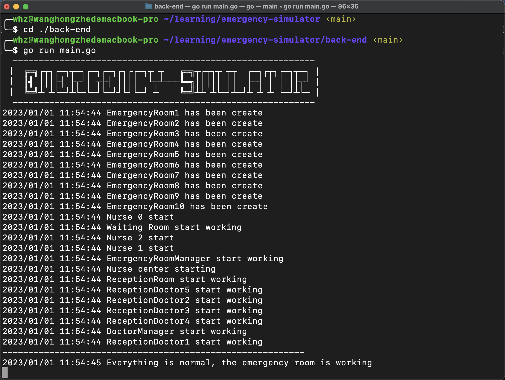
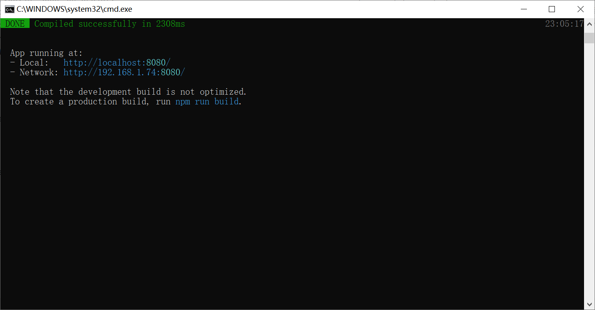
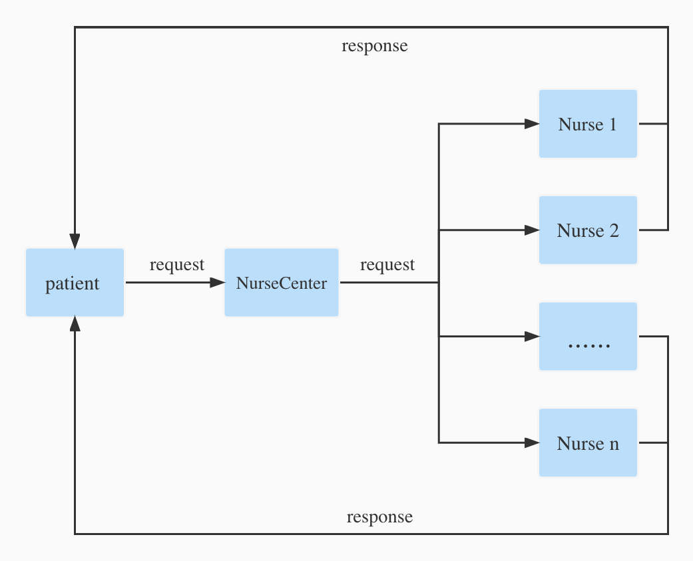
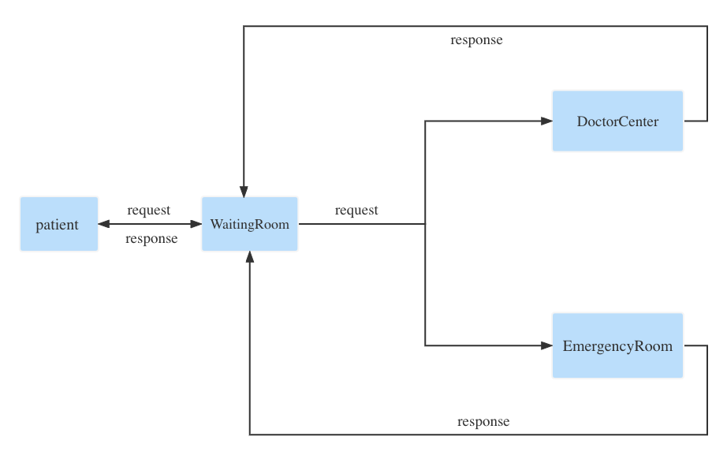
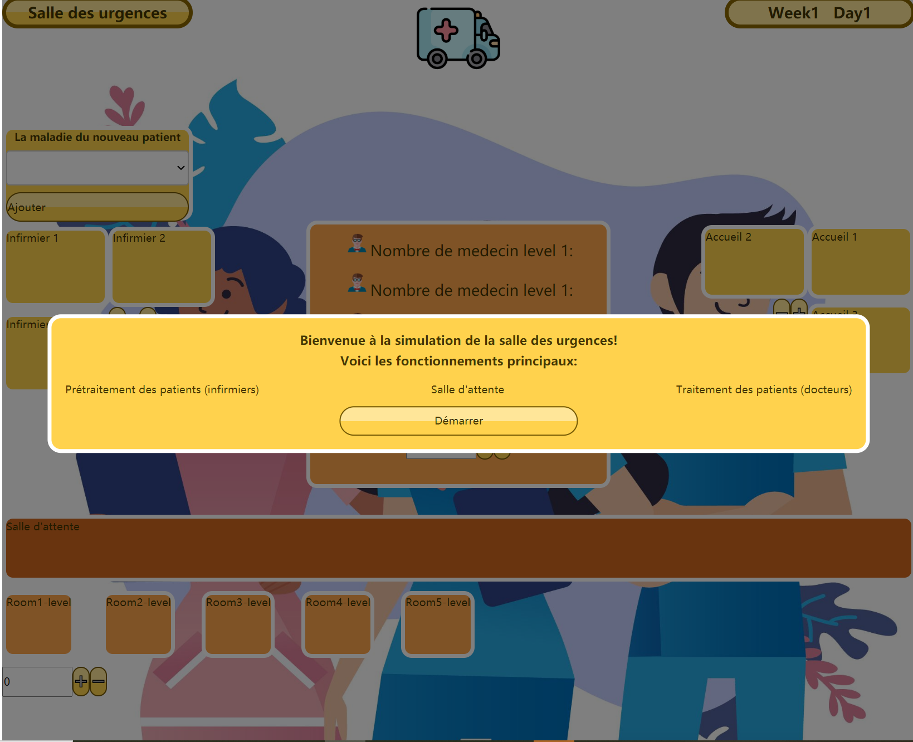
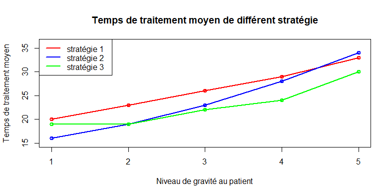
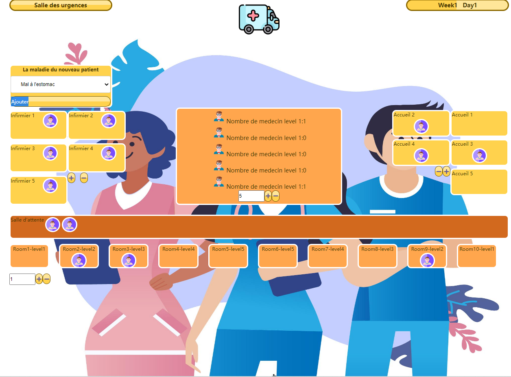
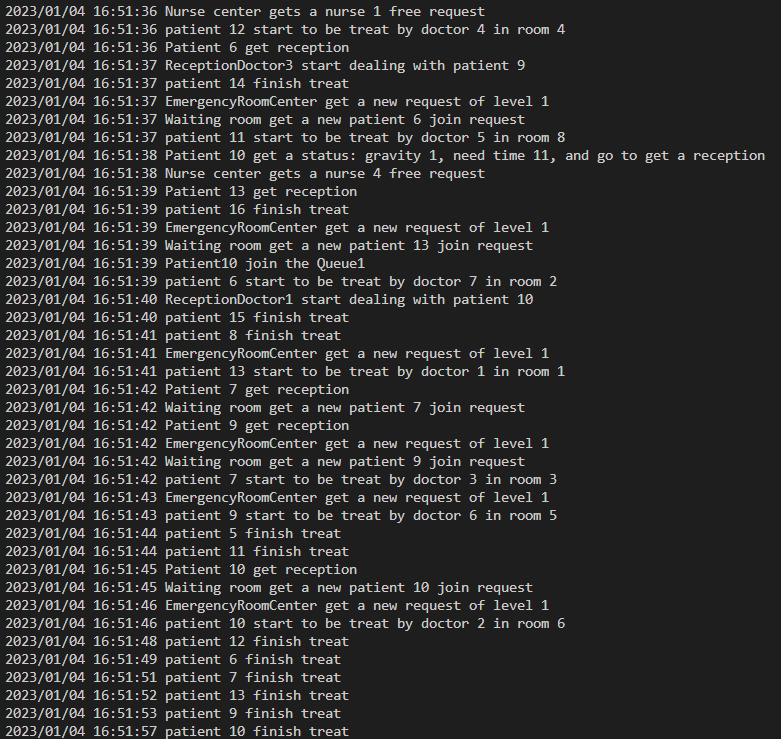

# Emergency-Simulator

## 1. Introduction

Dans le cadre de l'UV IA04, nous avons conçu et réalisé un projet de système de multi-agents dont le sujet est d'une simulation de service des urgences.

#### a. Problématique

Dans le contexte de la continuation de circulation du coronavirus et de la pénurie de ressources de santé publique, on cherche à répondre à la question : Quelle stratégie d'affectation des salles de consultation et des médecins est la plus performante pour que le service des urgences soit le plus efficace possible?
* Stratégie 1 : Premier arrivé, premier servi
* Stratégie 2 : Privilégier la ressource hospitalière sur la base de l'ordre d'arrivée
* Stratégie 3 : Ordre de priorité (privilégier toujours le patient le plus grave)

#### b. Modélisation

L'objectif de ce projet est donc de modéliser une salle des urgences d'un centre médical en se basant sur de différents types d'agents, de caractériser leurs comportements et de simuler leurs interactions. Dans le page web, un processus d'arrivée des patients à l'hôpital pour un traitement d'urgence peut être constaté d'une manière intuitive et interactive.

###### 8 Types d'agents
On dispose de 8 types d'agents en total dans ce projet.
* Patient
* Nurse
* NurseCenter
* Reception 
* ReceptionCenter
* WaitingRoom
* DoctorCenter 
* EmergencyRoomCenter

#### c. Interaction et fonctionnement

* Ajoute d'un patient

En choisissant une des différentes maladies et cliquant sur le bouton « ajouter » dans la page web, on simule l'arrivée d'un patient qu'il entre ensuite dans la queue et attend d'être traité. 

* Ajoute et suppression des infirmières, des receptions, des salles de consultation

* Simulation du processus de consultation

Le processus de consultation suivante est automatisé. Ce processus comprend 4 étapes : 
1. L'infirmière désigne un niveau de gravité au patient selon sa maladie
2. Il fait la queue pour s'inscrire dans l'accueil
3. Il attend dans la salle d'attente pour son ordre.
4. Le médecin consulte sa situation et le traite.

* Calcul du temps de traitement pour chaque patient


#### d. Architecture

On utilise le langage GO pour construire la structure des agents du côté back-end, la communication entre les agents est réalisée par channel. La partie de front-end est effectuée par Vue.js. Plus de détails seront présentées dans les chapitres suivants.

---

## 2. Quick Start

Gitlab repository : [here](https://gitlab.utc.fr/wanhongz/emergency-simulator).

#### a. back-end

1. Clonez le code source du projet à partir du site officiel utc gitlab.

```shell
git clone https://gitlab.utc.fr/wanhongz/emergency-simulator.git
```

2. Basculez vers le répertoire racine du back-end du projet

```bash
cd YOUR_PATH_OF_THE_PROJECT/back-end
```

3. Modifiez l'adresse IP et le Port de votre serveur dans le ficher **main.go** ( L'adresse par défaut est **"127.0.0.1:8082"** ).

4. Compilez avec la commande go build.

```go
go build
```

5. Ensuite, vous pouvez trouver l'exécutable **emergency-simulator** dans le répertoire racine du back-end, l'exécutez

```shell
./emergency-simulator
```

Normalement, vous devriez pouvoir voir l'invite indiquant que le projet démarre



#### b.front-end
##### Conditions préalables
Nous utilisons _Node.js_ et _Vue.js_ pour ce projet.  
À cause des fonctionnements des différentes versions, certaines versions récentes peuvent éventuellement conduire à l'erreur.  
Pour assurer un bon fonctionnement, nous vous demandons d'utiliser la version 16.18.1 de _Node.js_ ou celles antérieures.
Si vous ne disposez pas de _Vue.js_, installez-la en utilisant
```bash
npm install vue
```
##### Etapes
1. Il faut tout d'abord déplacer le répertoire au front-end
```bash
cd YOUR_PATH_OF_THE_PROJET/front-end
```
2. Ensuite, pour installer les dépendances, utilisez les commandes
```
npm install -g @vue/cli

npm install
```
3. La commande suivante vous permet de lancer l'application
```
npm run serve
```
Si tout vas bien, vous allez voir les informations suivantes




## 3. Types d'agents et leurs interactions 

##### Agent Patient 

L'agent le plus important est aussi l'agent ayant le plus de comportements, il a principalement les modèles de comportement suivants :

1. Il attendra à l'entrée du bureau d'accueil de l'hôpital, expliquera sa situation, et attendra que l'infirmière lui donne un jugement préliminaire
2. Faire la queue pour l'inscription
3. Faire la queue dans la salle d'attente pour que le médecin appelle
4. Traitement

##### Agent Nurse et Agent NurseCenter

L'agent utilisé pour assurer l'accueil et la pré-consultation des patients :

1. NurseCenter est responsable du traitement des demandes des patients et de leur distribution aux infirmières
2. L'infirmière exécute la tâche après avoir reçu la demande
3. L'infirmière informe le patient après le travail

##### Agent Reception et Agent ReceptionCenter

Pour l'inscription des patients :

1. Il existe plusieurs files d'attente et le patient choisit activement l'une d'entre elles pour attendre
2. Le médecin agréé traite la demande d'inscription du patient afin
3. Une fois l'inscription terminée, le patient sera informé

<center class="half">         </center>

##### Agent WaitingRoom

Utilisé pour la gestion de l'attente une fois l'enregistrement du patient terminé

##### Agent DoctorCenter et Agent EmergencyRoomCenter

Ressources nécessaires pour les visites de patients :

1. DoctorCenter vérifie si un médecin est disponible
2. EmergencyRoomCenter vérifie s'il y a une salle de consultation disponible
3. Si tous sont satisfaits, commencez à voir le patient

<div align=center></div>


## 4. Conception front-end
Il s'agit d'une application Web construite avec Vue.js, qui est principalement utilisée pour gérer les données transmises du backend et les présenter. 

Nous avons utilisé la fonctionnalité de liaison de données de réponse de Vue.js pour réaliser une mise à jour des données en temps réel et utilise des composants de vue pour composer la mise en page. 

En outre, il utilise également d'autres bibliothèques et plugins, tels qu'Axios et Vuex, pour réaliser l'acquisition et la gestion des données.

<div align=center></div>

### Points forts de la conception du front

- Mise à jour de données en temps réel  
Pour ce faire, nous avons utilisé une option très pratique en Vue.js : _Life Cycle_. 
Ce sont des méthodes prédéfinies qui existe tout au long de l'application.  
Ici nous avons appliqué la fonction _mounted()_, elle s'effectue automatiquement quand l'élément DOM a été rendu dans la page.
- Affichage dynamique  
Nous avons pu réaliser l'affichage dynamique en se basant sur les données transmises. Bien que ça paraisse un problème compliqué, 
nous avons trouvé une solution simple : utiliser des tableaux contenant selement 0 et 1 pour distinguer les statuts des patients et des salles.
## 5. Le résultat de l'expérience
### Le résultat
Nos application Web et serveur fonctionne avec success. Et il n'y a aucun problème dans le transfert de données entre le frontend et le backend.

Nous modélisons différents types d'agents(Patient, Nurse, NurseCenter, Reception, ReceptionCenter, WaitingRoom, DoctorCenter et EmergencyRoomCenter) et de simuler leurs interactions dans une salle des urgences d'un centre médical. 

Les utilisateurs peuvent sélectionner l'une des listes de maladies fournies pour créer un patient.

L'utilisateur peut également augmenter ou supprimer la capacité de NurseCenter, de ReceptionCenter et EmergencyRoomCenter, embaucher ou licencier des médecins selon ses préférences. Pour les médecins et les EmergencyRooms, l'utilisateur peut choisir un niveau qui correspond à la gravité de la maladie du patient.

Dans page web, L'utilisateur peut clairement voir le nombre de médecins actifs à chaque niveau et le nombre de salles d'urgence à chaque niveau en temps réel.

En calculant des temps d'attente de tous les patient pour les trois différentes stratégies d'allocation des ressources, on a constaté que la stratégie de l'"Ordre de priorité" présentait les temps d'attente moyens les plus faibles. Cependant, ce n'est pas toujours le cas dans la réalité, compte tenu de plusieurs raisons pratiques.
<div align=center>

</div>


Vous trouverez ci-dessous le résultat de l'exécution de notre frontend et de notre backend：
<div align=center>


</div>


### Les Points Positifs
- Peut voir de manière intuitive et interactive le processus d'arrivée des patients à l'hôpital pour un traitement d'urgence.
- Peut personnaliser des paramètres selon les préférences des utilisateurs.
- Peut comparer le temps de traitement des patients avec différentes sévérités sous différentes stratégies.

### Les Points Négatifs
- Fonctions à enrichir

## 6. Conclusion et Futur
Dans ce projet, on a pu construire un système de multi-agents et réaliser une simulation de scène réaliste. En même temps, la problématique que l'on a cherché à répondre a obtenu une réponse raisonable avec des résultats statistiques. Mais nous avons encore beaucoup de marge d'amélioration, par exemple on peut encore ajouter des function de payer, le prix de différents niveaux de patients sont different. c'est pour mieux simuler la situation commerciale d'une salle d'urgence.
